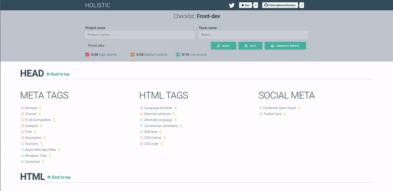

<h2 align="center"><a href="https://alexisdanizan.github.io">Checklist Tools Website</a></h2>

  <em>A user-friendly and fluid interface for using checklists.</em>

**Use the online version**: [alexisdanizan.github.io](https://alexisdanizan.github.io)

  
**All the power of checklists, without the overhead:**
 - User-friendly and fluid interface
 - Fast build with Preact and Milligram
 - Generate PDF report
 - Offline checklists storage with LocalStorage
 - 🆕💥 **Instant no-config app bundling**

## Getting Started
### How to use ?
### Install
### Customize
## Usage

